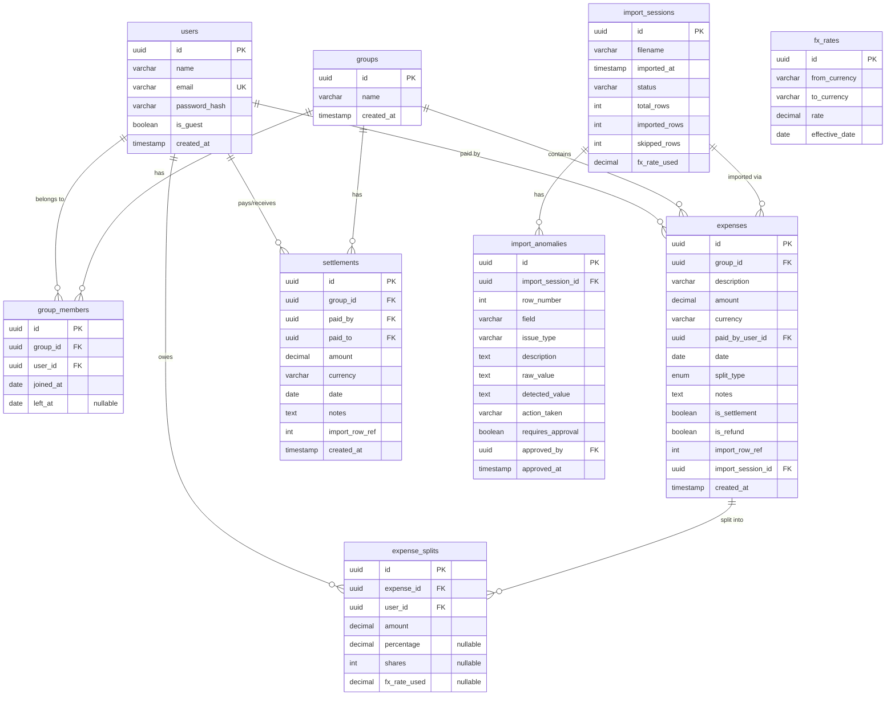

# SCOPE.md — FlatMate Shared Expenses App

## Database Schema

### Entity Relationship Diagram

### Table DDL Summary

#### users
- `id` UUID PRIMARY KEY
- `name` VARCHAR(255) NOT NULL
- `email` VARCHAR(255) UNIQUE NOT NULL
- `password_hash` VARCHAR(255) NOT NULL
- `is_guest` BOOLEAN DEFAULT false — for external participants like Dev, Kabir
- `created_at` TIMESTAMPTZ DEFAULT NOW()

#### groups
- `id` UUID PRIMARY KEY
- `name` VARCHAR(255) NOT NULL
- `created_at` TIMESTAMPTZ DEFAULT NOW()

#### group_members
- `id` UUID PRIMARY KEY
- `group_id` UUID FK → groups(id) ON DELETE CASCADE
- `user_id` UUID FK → users(id) ON DELETE CASCADE
- `joined_at` DATE NOT NULL
- `left_at` DATE — nullable; set when member moves out
- UNIQUE(group_id, user_id)

> **Design Note**: `left_at` enables time-scoped membership. When computing balances, a member is only included in expenses where `joined_at <= expense.date <= left_at`. This handles Meera (left March 28) and Sam (joined April 8) correctly.

#### expenses
- `id` UUID PRIMARY KEY
- `group_id` UUID FK → groups(id)
- `description` VARCHAR(500) NOT NULL
- `amount` DECIMAL(12,2) NOT NULL — negative values allowed (refunds)
- `currency` VARCHAR(3) NOT NULL DEFAULT 'INR'
- `paid_by_user_id` UUID FK → users(id)
- `date` DATE NOT NULL
- `split_type` ENUM('equal', 'unequal', 'percentage', 'share')
- `notes` TEXT
- `is_settlement` BOOLEAN DEFAULT false
- `is_refund` BOOLEAN DEFAULT false
- `import_row_ref` INTEGER — original CSV row number for traceability
- `import_session_id` UUID FK → import_sessions(id)
- `created_at` TIMESTAMPTZ DEFAULT NOW()

#### expense_splits
- `id` UUID PRIMARY KEY
- `expense_id` UUID FK → expenses(id) ON DELETE CASCADE
- `user_id` UUID FK → users(id)
- `amount` DECIMAL(12,2) NOT NULL — each participant's share in the expense's currency
- `percentage` DECIMAL(5,2) — only populated for percentage splits
- `shares` INTEGER — only populated for share splits
- `fx_rate_used` DECIMAL(12,6) — FX rate at import time (Rohan's traceability request)

#### settlements
- `id` UUID PRIMARY KEY
- `group_id` UUID FK → groups(id)
- `paid_by` UUID FK → users(id)
- `paid_to` UUID FK → users(id)
- `amount` DECIMAL(12,2) NOT NULL
- `currency` VARCHAR(3) DEFAULT 'INR'
- `date` DATE NOT NULL
- `notes` TEXT
- `import_row_ref` INTEGER
- `created_at` TIMESTAMPTZ DEFAULT NOW()

#### import_sessions
- `id` UUID PRIMARY KEY
- `filename` VARCHAR(255) NOT NULL
- `imported_at` TIMESTAMPTZ DEFAULT NOW()
- `status` VARCHAR(50) — 'preview', 'confirmed', 'failed'
- `total_rows` INTEGER
- `imported_rows` INTEGER
- `skipped_rows` INTEGER
- `fx_rate_used` DECIMAL(12,6)

#### import_anomalies
- `id` UUID PRIMARY KEY
- `import_session_id` UUID FK → import_sessions(id)
- `row_number` INTEGER NOT NULL
- `field` VARCHAR(100)
- `issue_type` VARCHAR(100) NOT NULL
- `description` TEXT
- `raw_value` TEXT
- `detected_value` TEXT
- `action_taken` VARCHAR(100)
- `requires_approval` BOOLEAN DEFAULT false
- `approved_by` UUID FK → users(id)
- `approved_at` TIMESTAMPTZ

#### fx_rates
- `id` UUID PRIMARY KEY
- `from_currency` VARCHAR(3) NOT NULL
- `to_currency` VARCHAR(3) NOT NULL
- `rate` DECIMAL(12,6) NOT NULL
- `effective_date` DATE NOT NULL
- UNIQUE(from_currency, to_currency, effective_date)

---

## Anomaly Log — `Expenses Export.csv`

All 19 anomalies detected during CSV import, with row numbers, raw values, policies, and rationale.

| # | Row | Issue Type | Field | Raw Value | Description | Policy Chosen | Rationale |
|---|-----|-----------|-------|-----------|-------------|---------------|-----------|
| 1 | 6 | `DUPLICATE_ROW` | all | `08-02-2026,dinner - marina bites,Dev,3200,INR,equal,...` | Row 6 is a duplicate of row 5 (same date, normalized description matches "Dinner at Marina Bites", same amount ₹3200, same payer Dev) | Mark as duplicate, require user approval before deletion | Silently deleting could lose data if the two entries are intentionally separate. User must confirm. |
| 2 | 14 | `SETTLEMENT_AS_EXPENSE` | description, notes | `"Rohan paid Aisha back"`, notes: `"this is a settlement not an expense??"` | Description contains "paid back" and notes explicitly say "settlement" — this is Rohan repaying Aisha ₹5000, not a shared expense | Move to `settlements` table (paid_by=Rohan, paid_to=Aisha), require approval | Settlements affect balances differently than expenses. Misclassifying would double-count the amount. |
| 3 | 7 | `COMMA_IN_AMOUNT` | amount | `"1,200"` | Electricity bill amount contains a comma as thousands separator. Not a valid float. | Auto-fix: strip comma → parse as 1200.00. Log anomaly. | Comma-in-number is a clear formatting issue with an unambiguous fix. No user intervention needed. |
| 4 | 13 | `MISSING_PAYER` | paid_by | `""` (empty) | House cleaning supplies (₹780) has no payer recorded. Notes say "can't remember who paid". | Block import of this row until user assigns a payer | Without a payer, we cannot credit anyone for this expense. Balance calculation would be incorrect. |
| 5 | 11 | `INCONSISTENT_PAYER_NAME` | paid_by | `"Priya S"` | "Priya S" appears only once; fuzzy match against known members finds "Priya" (Levenshtein distance = 2). Likely the same person with a surname initial. | Flag for user approval: suggest mapping "Priya S" → "Priya" | Could be a different person. User must confirm identity before we merge. |
| 6 | 9, 27 | `CASE_INCONSISTENCY` | paid_by | `"priya"` (row 9), `"rohan "` (row 27, trailing space) | Payer names with wrong casing or trailing whitespace. Canonical names are "Priya" and "Rohan". | Auto-fix: normalize to canonical casing, trim whitespace. Log both. | Casing/whitespace is clearly a typo, not ambiguous. Safe to auto-correct. |
| 7 | 34 | `AMBIGUOUS_DATE` | date | `"04-05-2026"` | In a file that predominantly uses DD-MM-YYYY, "04-05-2026" could be April 5 or May 4. Notes confirm confusion: "is this April 5 or May 4? format is a mess" | Flag as ambiguous, show both interpretations to user. Default to DD-MM (May 4) but do NOT auto-resolve. | Both dates are plausible. Wrong choice would place expense in wrong month, affecting balance scoping. |
| 8 | 27 | `NON_STANDARD_DATE` | date | `"Mar-14"` | Date format is "Mar-14" instead of DD-MM-YYYY. No year specified. | Auto-fix: parse as 14-03-2026 (assuming current CSV year context). Log anomaly. | Month abbreviation + day is unambiguous. Year inferred from surrounding rows (all 2026). |
| 9 | 28 | `MISSING_CURRENCY` | currency | `""` (empty) | Groceries DMart (₹2105) has no currency specified. Notes: "forgot to set currency". | Default to INR with warning. Require approval. | INR is the most likely default (domestic purchase at DMart), but user should confirm since USD expenses also exist in the file. |
| 10 | 31 | `ZERO_AMOUNT` | amount | `0` | Dinner order on Swiggy with amount=0. Notes: "counted twice earlier - fixing later" | Skip import, log as informational/void row. | Zero-amount expense has no financial impact. Notes confirm it's a correction placeholder. |
| 11 | 26 | `NEGATIVE_AMOUNT` | amount | `-30` | Parasailing refund of -30 USD. Notes: "one slot got cancelled" | Treat as refund/credit. Import with negative amount, flag `is_refund=true`. | Negative amounts represent legitimate refunds. The refund should reduce participants' obligations. |
| 12 | 15 | `PERCENTAGE_MISMATCH` | split_details | `"Aisha 30%; Rohan 30%; Priya 30%; Meera 20%"` → 110% | Pizza Friday percentage splits sum to 110%, not 100%. Notes: "percentages might be off" | Reject row. Do NOT import until user fixes percentages. Require approval. | Importing 110% would over-allocate the expense. There's no way to know which percentage is wrong. |
| 13 | 24, 25 | `DUPLICATE_DINNER` | description, amount | Row 24: `"Dinner at Thalassa"`, ₹2400, paid by Aisha. Row 25: `"Thalassa dinner"`, ₹2450, paid by Rohan | Same event (Thalassa dinner on March 11), but different amounts and different payers. Row 25's notes: "Aisha also logged this I think hers is wrong" | Flag BOTH rows. Require user to pick one. | Cannot determine which is correct programmatically. Different amounts and payers mean this isn't a simple duplicate. |
| 14 | 5, 23 | `EXTERNAL_PARTICIPANT` | split_with | `"Dev"` (row 5), `"Dev's friend Kabir"` (row 23) | Participants not in the formal group membership list. Dev appears in multiple Goa trip expenses; Kabir joined for one parasailing activity. | Auto-create as guest users (`is_guest=true`). Log in anomaly report. | External participants are valid expense sharers. Creating them as guests allows proper split calculation without formal group membership. |
| 15 | 36 | `MEERA_AFTER_DEPARTURE` | split_with | `"Aisha;Rohan;Priya;Meera"` | Row 36 (April 2 Groceries) includes Meera in the split, but Meera's `left_at = 2026-03-28`. Notes: "oops Meera still in the group list" | Auto-remove Meera from this split. Recalculate equal shares among remaining 3 members. Log anomaly. | Meera should not be charged for expenses after she moved out. The notes confirm this was an error. |
| 16 | — | `SAM_BEFORE_JOIN` | split_with | N/A | Scan all rows for Sam appearing before his `joined_at = 2026-04-08`. Sam first appears in row 38 (April 8) — no violations found. | No action needed. Detection logic validated. | Important to check even if no violations found. Proves the system actively enforces membership boundaries. |
| 17 | 38 | `SETTLEMENT_AS_DEPOSIT` | description | `"Sam deposit share"` | Sam paid ₹15000 to Aisha. Description says "deposit share" and notes say "Sam moving in! paid Aisha his deposit". This is a financial transfer (deposit), not a shared expense. | Flag for user classification. Suggest moving to settlements table. Require approval. | Deposits are one-to-one transfers, not shared expenses. Treating it as an expense would incorrectly split it among all members. |
| 18 | 42 | `CONFLICTING_SPLIT_TYPE` | split_type, split_details | split_type=`"equal"` but split_details=`"Aisha 1; Rohan 1; Priya 1; Sam 1"` | Furniture expense says "equal" split type, but also provides share values. Notes: "split_type says equal but someone added shares anyway" | Warn user. Use "share" logic since detail data is present (shares happen to be equal, but the data is explicit). Require approval. | When both split_type and split_details conflict, prefer the more specific data. However, user should confirm intent. |
| 19 | 10 | `EXCESS_PRECISION` | amount | `899.995` | Cylinder refill has 3 decimal places. Currency amounts should be 2 decimal places. | Auto-fix: round to 900.00. Log anomaly. | Financial amounts are always 2 decimal places. Rounding ₹899.995 → ₹900.00 is standard banker's rounding. |

### Summary Statistics
- **Total CSV rows**: 43 (excluding header)
- **Clean rows** (no anomalies): ~24
- **Rows with anomalies**: ~19 distinct anomaly instances across ~17 rows
- **Requires user approval**: 10 anomalies
- **Auto-fixable**: 7 anomalies
- **Rows to skip**: 1 (row 31, zero amount)
- **Settlements detected**: 2 (row 14, row 38)
